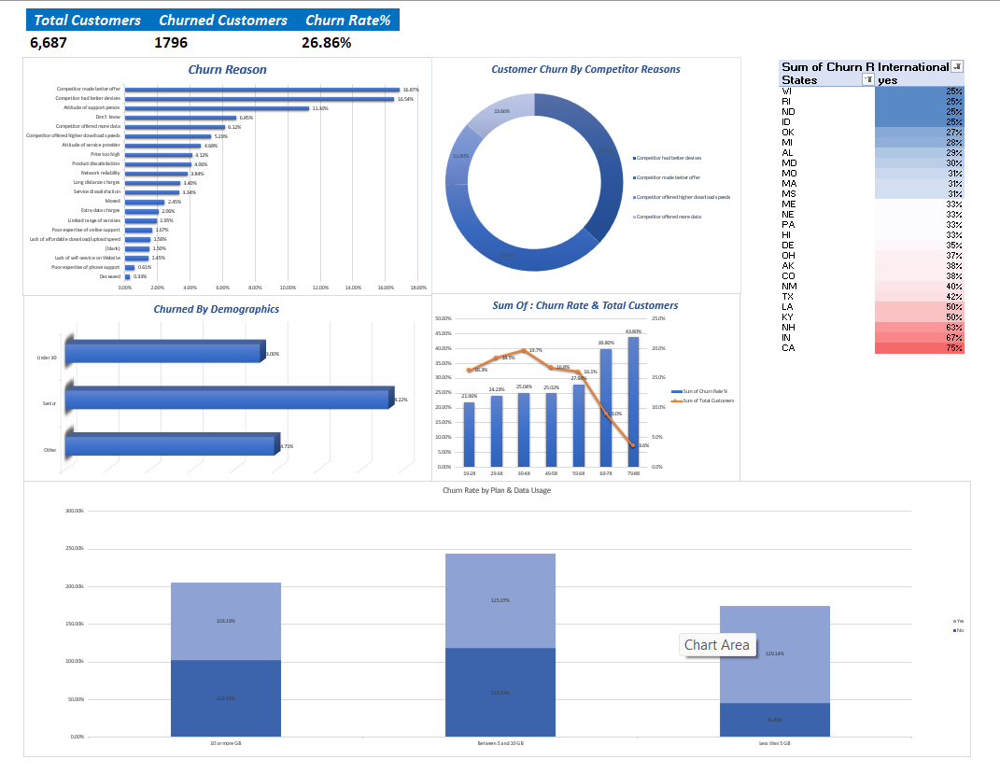

# Customer Churn Analysis

## 📌 Project Overview
Analyzing customer retention and identifying churn patterns using Microsoft Excel. This project focuses on understanding why customers leave and providing actionable insights.

## 📊 Dashboard Preview

## 🛠️ Tools & Skills
- **Data Cleaning:** Removing duplicates and handling missing values.
- **Analysis:** Pivot Tables, Advanced Formulas (VLOOKUP, IF).
- **Visualization:** Dynamic Charts and Interactive Dashboard.
